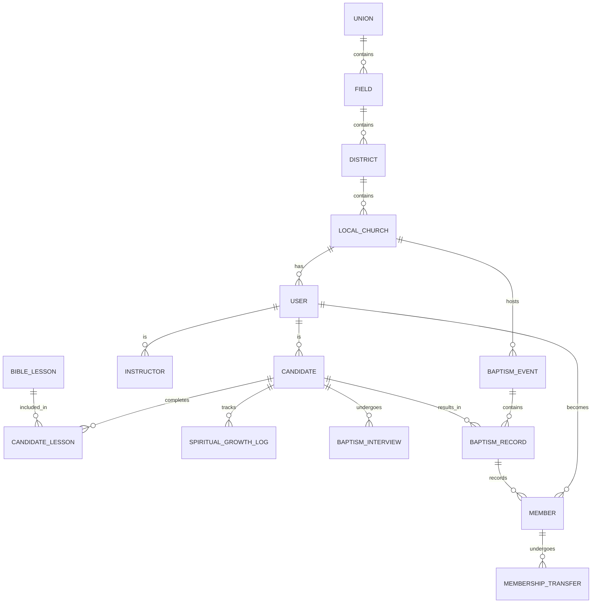

# BMS System Architecture

## Overview
The Baptism & Membership Preparation Management System (BMS) is designed to streamline the process of tracking baptism candidates, Bible study progress, and church membership across multiple levels of the church organization (Union, Field, District, Local Church).

## Architectural Principles
- **Scalability**: Designed to handle thousands of local churches and candidates.
- **Role-Based Access Control (RBAC)**: Fine-grained permissions based on user roles and church hierarchy levels.
- **Multi-Tenancy (Hierarchical)**: Data is partitioned and accessible based on the user's position in the church hierarchy.
- **Mobile-Responsive**: Accessible via web and mobile browsers for instructors and pastors in the field.

## Database Schema (ERD)



### Core Tables

#### Church Hierarchy
- `unions`: Highest level (e.g., Rwanda Union Mission).
- `fields`: Regional divisions.
- `districts`: Sub-regional divisions.
- `local_churches`: Individual congregations.

#### Users & Roles
- `users`: Central table for all persons (pastors, instructors, admins, candidates).
- Roles: `union_admin`, `field_admin`, `district_admin`, `church_admin`, `pastor`, `instructor`, `candidate`.

#### Candidate Management
- `candidates`: Profile information, status (`registered`, `in_progress`, `ready`, `baptized`).
- `bible_lessons`: Catalog of required lessons.
- `candidate_lessons`: Progress tracking (completion date, understanding score).

#### Spiritual & Baptism
- `spiritual_growth_logs`: Daily/weekly logs of spiritual disciplines and attendance.
- `baptism_interviews`: Record of readiness assessment.
- `baptism_events`: Scheduled ceremonies.
- `baptism_records`: Official record of baptism.

#### Membership
- `members`: Post-baptism membership status and history.
- `membership_transfers`: Tracking movement between local churches.

## Project Folder Structure

```text
/bms
├── docs/                # Architecture, API specifications, and User Guides
├── src/
│   ├── api/             # Backend API (Node.js/TypeScript)
│   │   ├── controllers/ # Request handlers
│   │   ├── middleware/  # Auth, RBAC, Validation
│   │   ├── models/      # Database schemas (Prisma/TypeORM)
│   │   ├── routes/      # API endpoints
│   │   └── services/    # Business logic
│   ├── web/             # Frontend Application (Next.js/React)
│   │   ├── components/  # Reusable UI elements
│   │   ├── hooks/       # Custom React hooks
│   │   ├── pages/       # Application views
│   │   └── store/       # State management
│   └── shared/          # Shared types, constants, and validation schemas
├── scripts/             # DB Migrations, Seeding, Deployment scripts
├── tests/               # Unit, Integration, and E2E tests
└── README.md
```

## Security & Access Control
- **Authentication**: JWT-based with Multi-Factor Authentication (MFA) support.
- **Authorization**: RBAC combined with hierarchical scope. 
  - *Example*: A District Admin can see all candidates in their district's churches but not candidates in other districts.
- **Audit Logging**: All significant changes (status changes, deletions) are logged.
